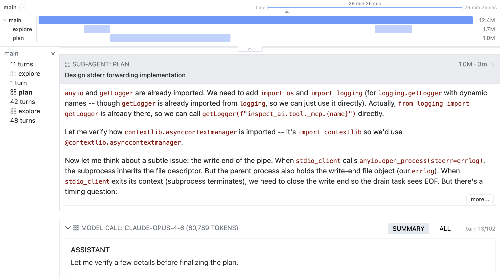
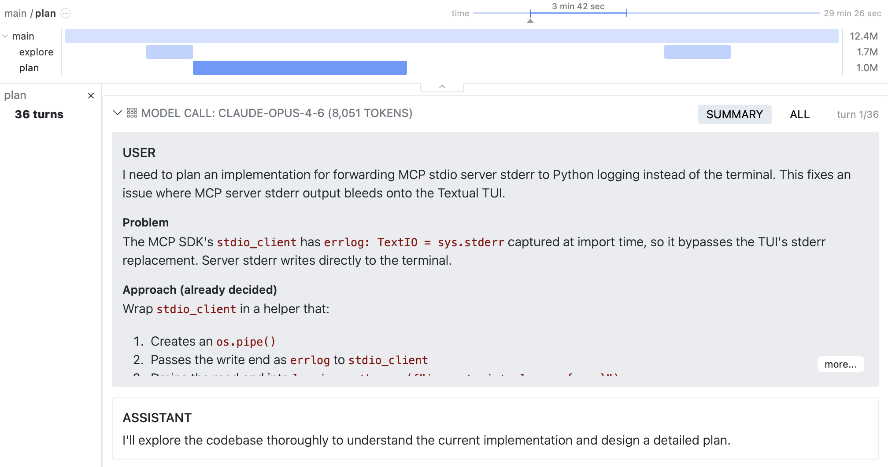

As AI agents take on increasingly complex long-horizon tasks, evaluation frameworks are also scaling up. This includes supporting more sophisticated agent scaffolds, running tasks that consume hundreds of millions of tokens, and visualization of multi-agent trajectories.

Over the past few months we've added many features to address these new requirements. This post rounds up this work as well as looks ahead to some new features, including a new multi-agent orchestrator and the ability to checkpoint and resume long running samples.

## Inspect SWE

The [inspect_swe](https://meridianlabs-ai.github.io/inspect_swe/) package makes software engineering agents like [Claude Code](https://meridianlabs-ai.github.io/inspect_swe/claude_code.html), [Codex CLI](https://meridianlabs-ai.github.io/inspect_swe/codex_cli.html), [Gemini CLI](https://meridianlabs-ai.github.io/inspect_swe/gemini_cli.html), and [Mini SWE Agent](https://meridianlabs-ai.github.io/inspect_swe/mini_swe_agent.html) available as standard Inspect agents. For example, here we use the `claude_code()` agent as the solver in an Inspect task:

``` python
from inspect_ai import Task, task
from inspect_ai.dataset import json_dataset
from inspect_ai.scorer import model_graded_qa

from inspect_swe import claude_code

@task
def system_explorer() -> Task:
    return Task(
        dataset=json_dataset("dataset.json"),
        solver=claude_code(),
        scorer=model_graded_qa(),
        sandbox="docker",
    )
```

Inspect SWE agents are implemented using the Inspect [Sandbox Agent Bridge](https://inspect.aisi.org.uk/agent-bridge.html#sandbox-bridge).

Agents run inside the sample sandbox and their model API calls are proxied back to Inspect. This means that you can use any model with Inspect SWE agents, and that features like token or time limits and log transcripts work as normal with the agents.

## Timelines

Increasingly, agent scaffolds are utilizing multiple agents to parallelize work and keep context windows coherent. The transcripts created by multi-agent architectures are, however, much harder to read as they aren't just a simple message history. To address this, we introduce timelines, which automatically detect sub-agents in a transcript and provide a clean view of the main agent trajectory and its calls to sub-agents:

{.border}

Drill into any sub-agent to view its trajectory:

{.border}

## Compaction

[Compaction](https://inspect.aisi.org.uk/compaction.html) enables you to automatically manage conversation context as it grows, helping you optimize costs and stay within context window limits for long-running agents. Several compaction strategies are available:

|  |  |
|----|----|
| [CompactionAuto](https://inspect.aisi.org.uk/reference/inspect_ai.model.html#compactionauto) | Automatic compaction: tries native first, falls back to summary. |
| [CompactionNative](https://inspect.aisi.org.uk/reference/inspect_ai.model.html#compactionnative) | Use provider-specific native compaction API (OpenAI and Anthropic only). |
| [CompactionSummary](https://inspect.aisi.org.uk/reference/inspect_ai.model.html#compactionsummary) | Compact by having a model create a summary of the message history. |
| [CompactionEdit](https://inspect.aisi.org.uk/reference/inspect_ai.model.html#compactionedit) | Compact by editing the message history to remove content (e.g. tool call results and reasoning). |
| [CompactionTrim](https://inspect.aisi.org.uk/reference/inspect_ai.model.html#compactiontrim) | Compact by trimming the message history to preserve a percentage of the input. |

: {tbl-colwidths=[40,60]}

Compaction is built-in to the [ReAct Agent](https://inspect.aisi.org.uk/react-agent.html) and the [Agent Bridge](https://inspect.aisi.org.uk/agent-bridge.html#agent-bridge) and can also be added to custom agents. Here are some examples of using compaction with the [react()](https://inspect.aisi.org.uk/reference/inspect_ai.agent.html#react) agent:

``` python
from inspect_ai.agent import react
from inspect_ai.model import (
    CompactionAuto, CompactionEdit, CompactionNative
)
from inspect_ai.tool import bash, text_editor

# automatic compaction (recommended default)
react(
    tools=[bash(), text_editor()],
    compaction=CompactionAuto()
)

# edit compaction
react(
    tools=[bash(), text_editor()],
    compaction=CompactionEdit(keep_tool_uses=3)
)
```

Compaction can also make use of the [memory()](https://inspect.aisi.org.uk/compaction.html#memory-tool) tool to offload important context to files prior to compaction.

## Deep Agents

We've recently introduced several built-in tools that help agents manage complex tasks over many steps:

- [skill()](https://inspect.aisi.org.uk/tools-standard.html#sec-skill) — Implements the new [agent skills standard](https://agentskills.io/home), giving agents access to structured capabilities.

- [update_plan()](https://inspect.aisi.org.uk/tools-standard.html#sec-update-plan) — Provides a todo-list that helps agents track and update plans across many steps.

- [memory()](https://inspect.aisi.org.uk/tools-standard.html#sec-memory) — Enables agents to store and retrieve information across a long conversation.

All of these work with the built-in [react()](https://inspect.aisi.org.uk/react-agent.html) agent and can also be integrated into custom agents.

Looking ahead, we're designing a new `deepagent()` which is a higher-level agent that bundles the patterns we see in production agents like Claude Code and Codex CLI into a unified Inspect primitive. Deep agents will include pre-built subagent types for common patterns — `research()` for read-only information gathering, `plan()` for structured planning, and `general()` for exploratory work with full tool access. 

We've published an [RFC for deep agents](https://github.com/UKGovernmentBEIS/inspect_ai/issues/3768) and would love your feedback on the design!

## Checkpointing

As evaluations grow longer (sometimes running for days or even weeks), a single infrastructure failure can throw away enormous amounts of agent work. Checkpointing will enable agents to save their progress at regular intervals and resume from the last saved point rather than restarting from scratch.

Checkpointing captures the state required for agent resumption, including conversation history, sandbox filesystem state, and the sample's data store. Resumption will integrate transparently with Inspect's existing retry machinery. After a crash, `inspect eval-set` and `inspect eval-retry` will automatically resume incomplete samples from their latest checkpoint.

We've published an [RFC for checkpointing](https://github.com/UKGovernmentBEIS/inspect_ai/issues/3769). If you're running long-horizon evaluations we'd love to hear your feedback.
